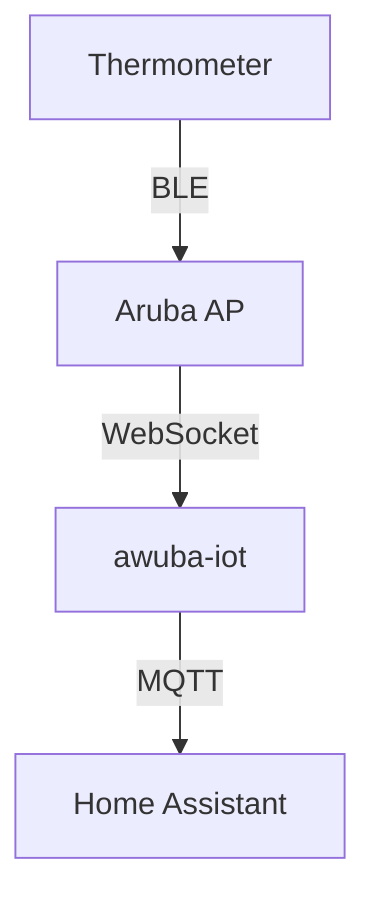

# `awuba-iot`

A minimal Aruba AOS8 IOT server for bridging telemetry from ATC1441 & PVVX thermometers to an MQTT broker. `awuba-iot` also publishes discovery messages for Home Assistant compatibility.

## Data Flow



Each Aruba AP establishes its own connection with `awuba-iot`, and packets are deduplicated by `awuba-iot`.

Once a new sensor is detected, `awuba-iot` publishes Home Assistant discovery packets in MQTT, which should populate HASS with individual sensors.

## Getting Started

`awuba-iot` is run in a container. Published container images are available in the GitHub container registry: `ghcr.io/k3das/awuba-iot`. Stable releases are tagged as `latest`.

### Docker Compose

Minimal `docker-compose.yaml` configuration: 

```yaml
services:
  awuba:
    image: ghcr.io/k3das/awuba-iot:latest
    ports:
      - 7443:7443
    environment:
      - AWUBA__APP__ACCESS_TOKEN=12345678
      - AWUBA__MQTT__BROKER_HOST=mosquitto
      - AWUBA__MQTT__BROKER_PORT=1883
```

Tweak the environment variables to match your deployment. A complete example (including a Mosquitto broker and Home Assistant instance) could be found in [./compose.yaml](`/compose.yaml`).

### Aruba Instant AOS8

In the AOS8 controller console, an IOT transport profile and an IOT radio profile need to be defined for telemetry to be streamed to `awuba-iot`.

On AOS8-Instant:

```
config t
    iot transportProfile "awuba-iot-ble"
        endpointURL "ws://[AWUBA_IOT_ENDPOINT]:7443/ws"
        endpointType telemetry-websocket
        endpointToken 12345678
        bleDataForwarding
        perFrameFiltering
        blePeriodicTelemetryDisable
        no deviceCountOnly

        macOuiFilter a4c138 
        exit
    iot useTransportProfile "awuba-iot-ble"

    iot radio-profile "ble-scan"
        radio-mode ble
        ble-opmode scanning
        exit
    iot use-radio-profile "ble-scan"

    end
commit apply
```

Replace `[AWUBA_IOT_ENDPOINT]` with `awuba-iot`'s respective address. 

Note the `macOuiFilter` field. By default, Aruba does not support using a catch all for BLE packets, so instead an OUI filter for relevant sensors must be configured. `a4c138` is the OUI prefix for Telink/Xiaomi Mijia sensors.

More information can be found in the [Aruba AOS 8 Instant user guide](https://arubanetworking.hpe.com/techdocs/Aruba-Instant-8.x-Books/811/Aruba-Instant-8.11.0.0-User-Guide.pdf).

Non-instant ArubaOS has similar, but different configuration. Refer to the respective user guide.

## Configuration

`awuba-iot` looks for a `config.toml` in the directory that it's running in. An example is provided in [./config.toml](`/config.toml`). 

Configuration could also be supplied through environment variables prefixed by `AWUBA__`, where

```toml
[app]
access_token = "12345678"
```

would be defined as `AWUBA__APP__ACCESS_TOKEN=12345678`.

## Development

The protobuf toolchain (`protoc`) is required by prost for generating protobuf code during build. Follow the [protobuf docs](https://protobuf.dev/installation/) for installing protoc.

Once protoc is installed, you could use standard rust tooling for building and running `awuba-iot`:

```shell
$ cargo run
```

to run with debug logging:

```shell
$ RUST_LOG="awuba_iot=debug,tower_http=debug" cargo run
```
